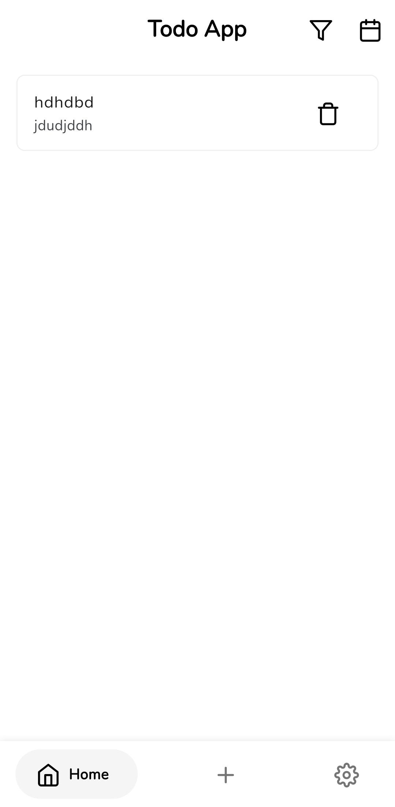
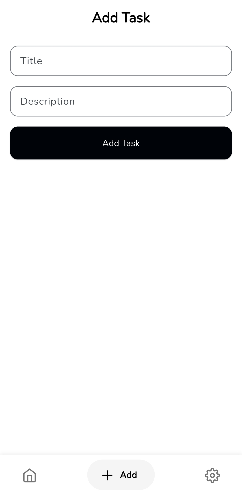
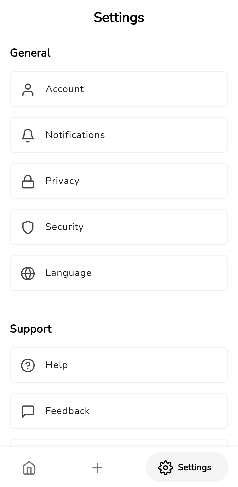

Here is the revised `README.md` with the missing sections and some formatting corrections:

```markdown
# Todo List Mobile App

A simple and intuitive Todo List mobile application built with Flutter and Firebase. This app allows users to manage their tasks efficiently with features like task creation, deletion, and filtering by date.

## Features

- User Authentication (Firebase Auth)
- Task Management (Create, Read, Delete)
- Filter Tasks by Date
- Sort Tasks by Creation Date
- Responsive UI

## Screenshots





## Getting Started

### Prerequisites

- [Flutter](https://flutter.dev/docs/get-started/install) (version 2.0 or higher)
- [Firebase Account](https://firebase.google.com/)

### Installation

1. **Clone the repository:**

   ```sh
   git clone https://github.com/yourusername/todo_list_app.git
   cd todo_list_app
   ```

2. **Install dependencies:**

   ```sh
   flutter pub get
   ```

3. **Set up Firebase:**

   - Go to the [Firebase Console](https://console.firebase.google.com/).
   - Create a new project.
   - Add an Android/iOS app to your Firebase project.
   - Follow the instructions to download the `google-services.json` (for Android) or `GoogleService-Info.plist` (for iOS) and place it in the appropriate directory.

### Running the App

1. **Run the app on an emulator or connected device:**

   ```sh
   flutter run
   ```

## Contributing

Contributions are welcome! Please fork this repository and submit a pull request for any enhancements or bug fixes.

## License

This project is licensed under the MIT License - see the [LICENSE](LICENSE) file for details.
```

This structure ensures that all necessary instructions are provided, and the formatting is consistent. If you need any further adjustments or additions, feel free to ask!